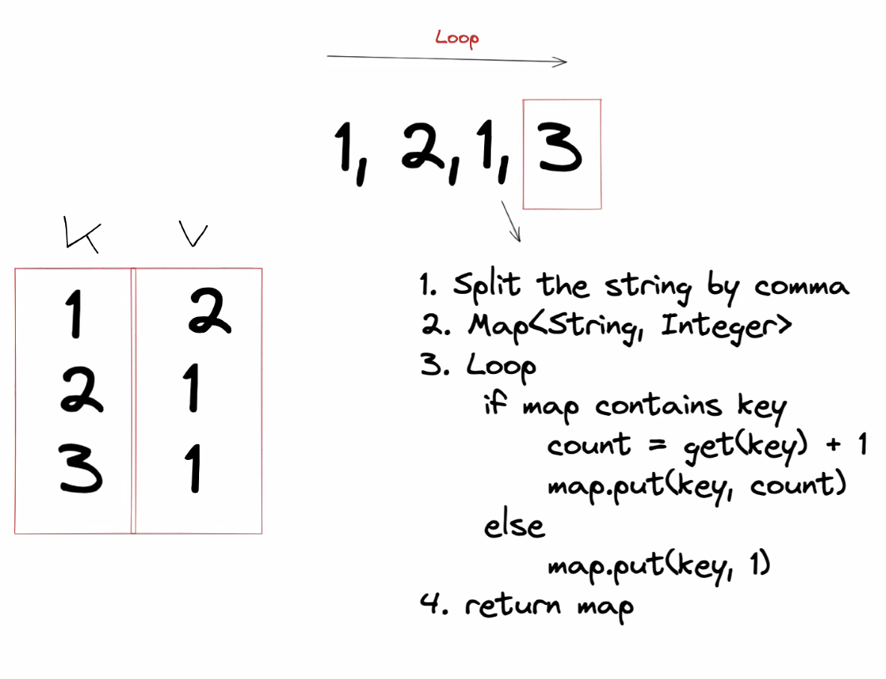
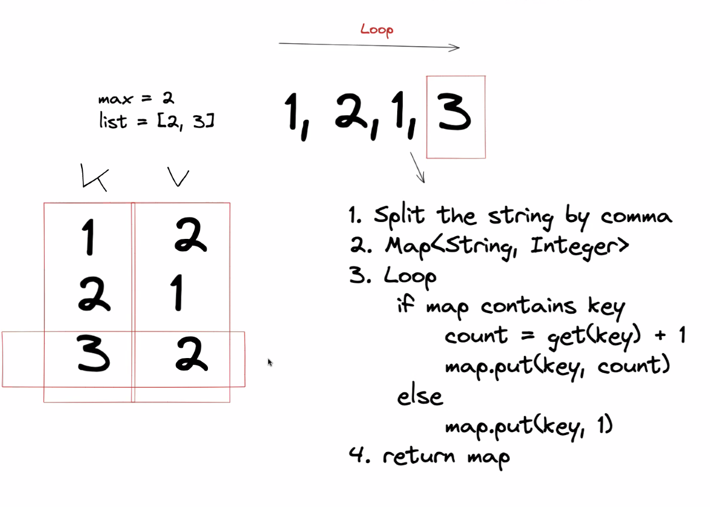
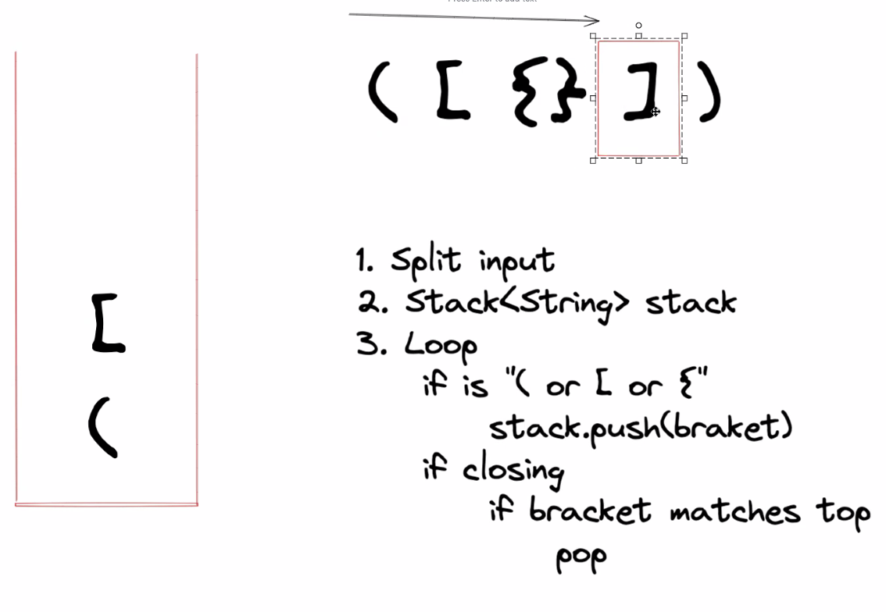
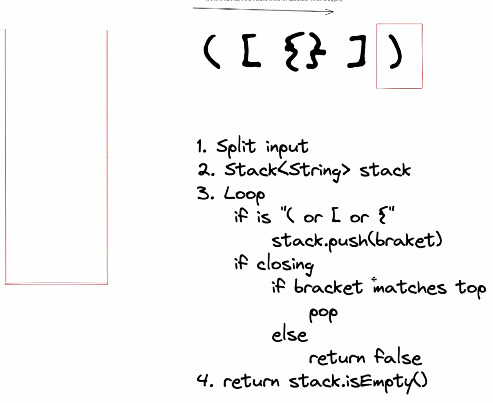

# Exercises

## Exercise 1: Number of occurences

- Given the follwing array of strings. String[] input = "1,1,1,1,3,4,5,6,7,7,7,8,8";
- Find the number of occurences for each element
- Your method should return something like the following:

```
{
    "1": 4,
    "3": 1,
    "4": 1,
    "5": 1,
    "6": 1,
    "7": 3,
    "8": 2
}
```

- Think about the data structure that you should use
- Create a method. Think about the return type and parameters
- Write unit tests for your method



[Link to Exercise 1 solution](https://github.com/RKaurB/bnta-c4-java/blob/main/src/main/java/com/bnta/s12_using_data_structures/exercises/Exercise1.java)


## Exercise 2: Most number of occurences

- Given the follwing array of strings. String[] input = "1,1,1,1,3,4,5,6,7,7,7,8,8";
- Find the element that has the most number of occurences
- Your method should return something like the 1 since it occurs 4 times
- Think about the datastructure that you should use
- Create a method. Think about the return type and parameters
- Write unit tests for your method



[Link to Exercise 2 solution](https://github.com/RKaurB/bnta-c4-java/blob/main/src/main/java/com/bnta/s12_using_data_structures/exercises/Exercise2.java)


## Exercise 3: Parenthesis checker

Given the following inputs:

```
String brackets = "[{{[(){}]}}[]{}{{(())}}]";
String brackets = "[{{}}[]{}{{(())}}]";
String brackets = "[{}{}{{()}}]";
String brackets = "[{}{{}}]";
String brackets = "[{{}}]";
String brackets = "[{}]";
String brackets = ""; 
```

Check if the following parenteshis are balanced. i.e.

```
[] - true
[[] - false
({[]}) - true
({[}) - false
```

Think about which data structure you should use, implement the following method, and write unit tests:

```
public boolean isBalanced(String input) {
return false;
}
```






[Link to Exercise 3 solution](https://github.com/RKaurB/bnta-c4-java/blob/main/src/main/java/com/bnta/s12_using_data_structures/exercises/Exercise3.java)
